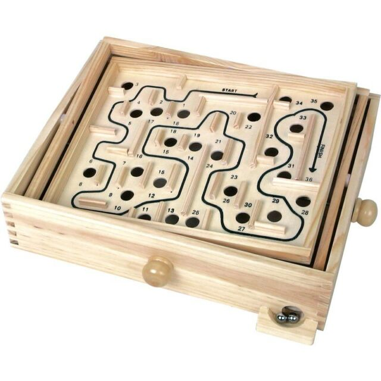

# Mazes

Maze generation experiments

# Wooden Labyrinth

I am trying to come up with a waay to generate random versions of this type of maze.
It is a unicursal maze, has no dead-end, also known as Labyrinth.
It also appears to be a type of space filling curve, with holes on the space that is being filled.
Many space filling curves can be generated using L-systems.

# Implementation

My current code generates Hilbert Curves using fairly generalised L-system code.
I also have some code for generating a standard maze using a depth-first backtracking approch.

It is all written in ClojureScript and renders to the browser using HTML5 canvas.

# Space filling curves

https://en.wikipedia.org/wiki/Space-filling_curve

* [Hilbert's Space-filling Curve for Regions with Holes](https://www.researchgate.net/publication/319643051_Hilbert's_Space-filling_Curve_for_Regions_with_Holes)
* [Context-based Space Filling Curves](http://theory.stanford.edu/~matias/papers/eg2000.pdf)
* [Brownian Bricklayer: A random space-filling curve](https://arxiv.org/pdf/1708.07172.pdf)

# L-systems

https://en.wikipedia.org/wiki/L-system

* [Two-dimensional L-systems](http://mathforum.org/advanced/robertd/lsys2d.html)

# Maze generation

https://en.wikipedia.org/wiki/Maze_generation_algorithm

* [Unicursal random maze tool path for computer-controlled optical surfacing](https://www.researchgate.net/publication/284412154_Unicursal_random_maze_tool_path_for_computer-controlled_optical_surfacing)
*[Maze Generation: Eller's Algorithm](https://weblog.jamisbuck.org/2010/12/29/maze-generation-eller-s-algorithm)
    - Unicursal Maze generation ideas in the comments
* [Maze Classification](https://www.astrolog.org/labyrnth/algrithm.htm)
* [Stack Overflow: Algorithm for maze generation with no dead ends?](https://stackoverflow.com/questions/7369945/algorithm-for-maze-generation-with-no-dead-ends)
* [Unicursal Mazes](http://www.michaelchaney.com/2014/03/unicursal-mazes/)

# Conway's Game of Life

https://en.wikipedia.org/wiki/Conway%27s_Game_of_Life

* [Chris Grand GOL in Clojure](http://clj-me.cgrand.net/2011/08/19/conways-game-of-life/)
